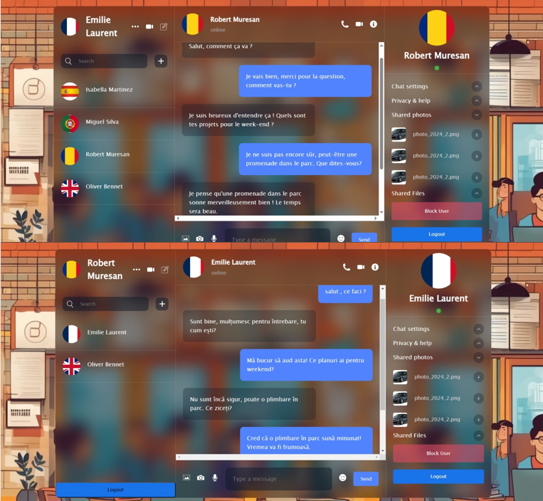
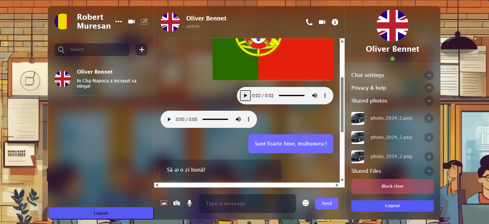
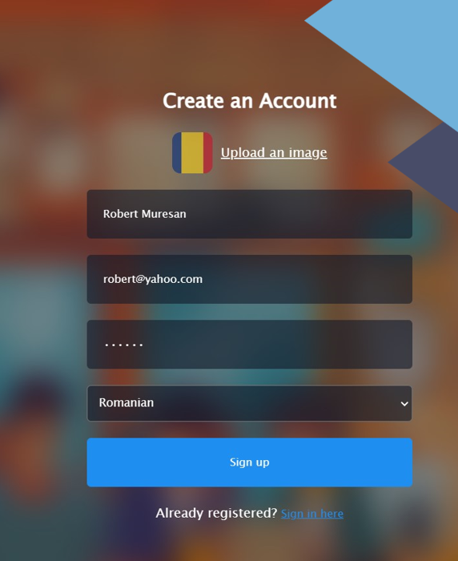

# Live Chat Audio Translation App

This app enables real-time audio message translation using OpenAI’s ChatGPT for text translation, Whisper for speech-to-text and text-to-speech Firebase for storing and retrieving audio files, and a React frontend for user interaction.






## Features

- **Audio Translations**: Converts speech-to-text, translates it, and returns text-to-speech in the target language.
- **Text Translations**: Translates text messages between different languages in real-time.
- **Firebase Integration**: Audio files are uploaded and retrieved from Firebase Storage.
- **Multi-user Chat**: Support for translating and storing audio messages between different users.

## Prerequisites

- **Python 3.8+**
- **Firebase Project** with Storage enabled
- **OpenAI API Key** (for ChatGPT model translations)
- **Node.js**

## Setup

### 1. Clone the Repository

```bash
git https://github.com/EugenVasilachi/LiveChat-with-Text-and-Audio-Translation.git
```

### 2. Install Dependencies

```bash
cd backend
pip install -r requirements.txt (Flask)

cd src
npm install (React)
```

### 3. Firebase Configuration

- Go to the Firebase Console and download the Firebase Admin SDK JSON credentials from Project Settings > Service Accounts.
- Place the firebase-adminsdk.json file in the root directory of your project.

### 4. Environment Variables

```bash
FIREBASE_CREDENTIALS=path/to/firebase-adminsdk.json
FIREBASE_BUCKET=your-project-id.appspot.com
OPEN_AI_KEY=your-openai-api-key
```

### 5. Run the Application

```bash
cd backend
python -m main

cd src
npm run dev
```
